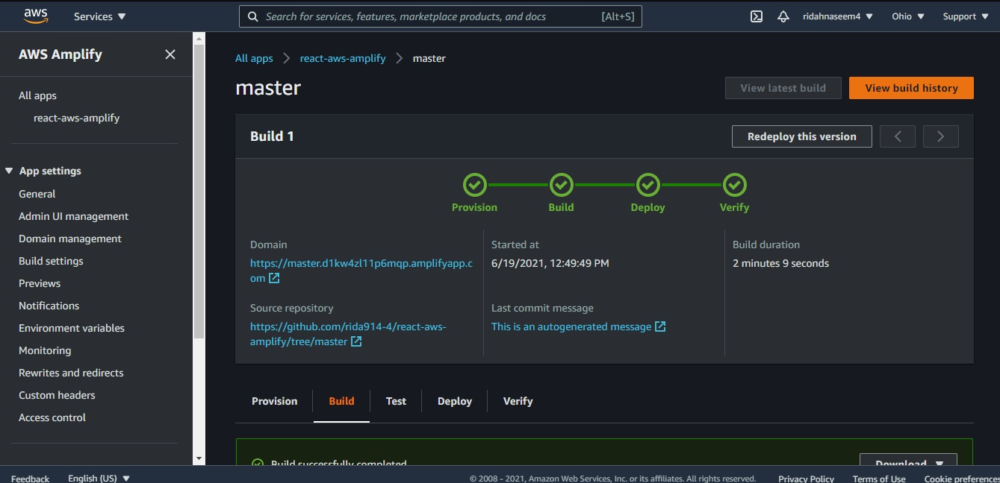

###### Key Features
- Fully functional REACT APP deployed on AWS Free tier
- CI/CD pipelines
- Authentication enabled
- Static data manipulation
- Local and Remote code deployment and microservices access

###### AWS Amplify
AWS amplify can allow us to build/deploy/host pre-existing mobile and web applications in a matter of minutes. We can

- Setup a backend to enable data, authentication, or storage capabilities. Then integrate them in our app with just a few steps.
- Connect our Git repository to continuously deploy our frontend and backend. Host it on a globally available CDN.
- Setup AWS amplify by simply clicking 'Get started' on deployment

##### steps

- Build a REACT app using npm package mananger and npx
- Open AWS Amplify and deploy you app 

Integrate your Github Repo with the AWS amplify 

You can see that the React app is deployed and is live. Just click the production URL.

Bring the application live by deploying the app.

